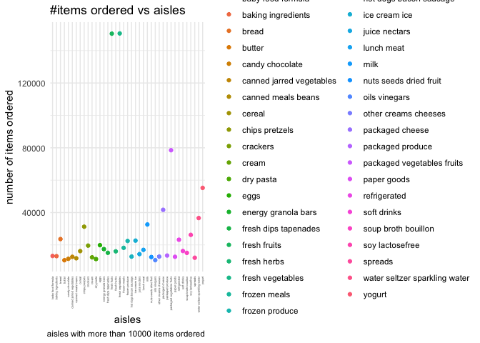
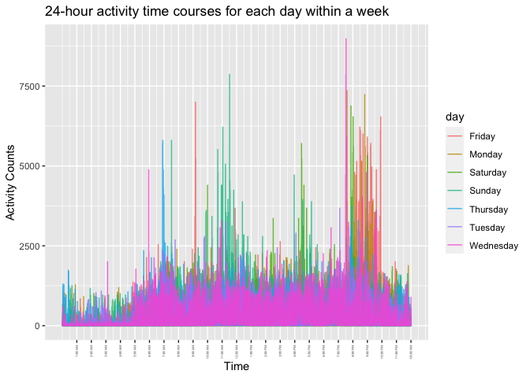
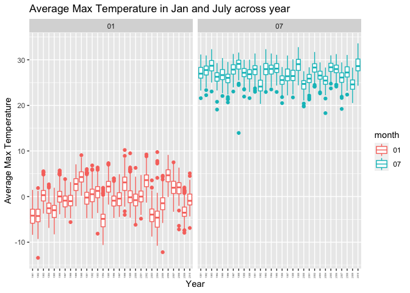
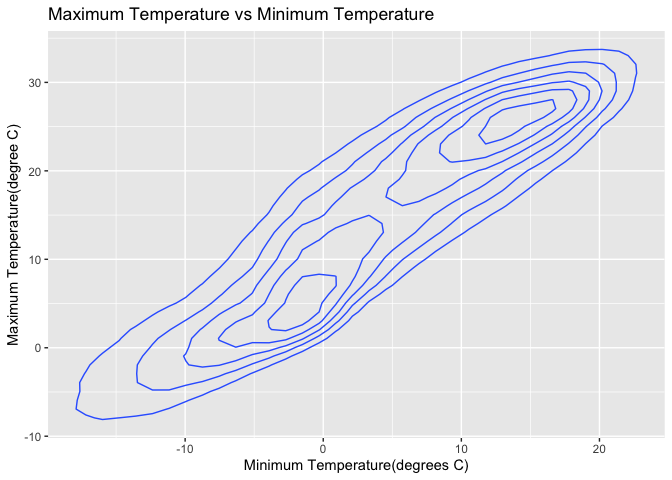
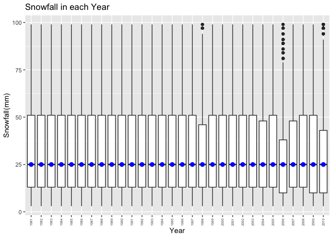

p8105_hw3_sk5152
================
Shuting Kang
2022-10-11

## Problem 1

``` r
library(p8105.datasets)
library(tidyverse)
```

    ## ── Attaching packages ─────────────────────────────────────── tidyverse 1.3.2 ──
    ## ✔ ggplot2 3.3.6      ✔ purrr   0.3.4 
    ## ✔ tibble  3.1.8      ✔ dplyr   1.0.10
    ## ✔ tidyr   1.2.0      ✔ stringr 1.4.1 
    ## ✔ readr   2.1.2      ✔ forcats 0.5.2 
    ## ── Conflicts ────────────────────────────────────────── tidyverse_conflicts() ──
    ## ✖ dplyr::filter() masks stats::filter()
    ## ✖ dplyr::lag()    masks stats::lag()

``` r
library(ggridges)
data("instacart")
instacart
```

    ## # A tibble: 1,384,617 × 15
    ##    order_id product_id add_to_…¹ reord…² user_id eval_…³ order…⁴ order…⁵ order…⁶
    ##       <int>      <int>     <int>   <int>   <int> <chr>     <int>   <int>   <int>
    ##  1        1      49302         1       1  112108 train         4       4      10
    ##  2        1      11109         2       1  112108 train         4       4      10
    ##  3        1      10246         3       0  112108 train         4       4      10
    ##  4        1      49683         4       0  112108 train         4       4      10
    ##  5        1      43633         5       1  112108 train         4       4      10
    ##  6        1      13176         6       0  112108 train         4       4      10
    ##  7        1      47209         7       0  112108 train         4       4      10
    ##  8        1      22035         8       1  112108 train         4       4      10
    ##  9       36      39612         1       0   79431 train        23       6      18
    ## 10       36      19660         2       1   79431 train        23       6      18
    ## # … with 1,384,607 more rows, 6 more variables: days_since_prior_order <int>,
    ## #   product_name <chr>, aisle_id <int>, department_id <int>, aisle <chr>,
    ## #   department <chr>, and abbreviated variable names ¹​add_to_cart_order,
    ## #   ²​reordered, ³​eval_set, ⁴​order_number, ⁵​order_dow, ⁶​order_hour_of_day

``` r
aisles=
  instacart%>%
    group_by(aisle)%>%
    summarize(n_obs=n())%>%
    arrange(desc(n_obs))
aisles
```

    ## # A tibble: 134 × 2
    ##    aisle                          n_obs
    ##    <chr>                          <int>
    ##  1 fresh vegetables              150609
    ##  2 fresh fruits                  150473
    ##  3 packaged vegetables fruits     78493
    ##  4 yogurt                         55240
    ##  5 packaged cheese                41699
    ##  6 water seltzer sparkling water  36617
    ##  7 milk                           32644
    ##  8 chips pretzels                 31269
    ##  9 soy lactosefree                26240
    ## 10 bread                          23635
    ## # … with 124 more rows

Based on “The Instacart Online Grocery Shopping Dataset 2017”, there
were totally 134 aisle, and the most ordered aisle included fresh
vegetables, fresh fruits, packaged vegatables fruits, and yogurt.

``` r
aisles_plot=
  instacart%>%
    group_by(aisle)%>%
    summarize(n_obs=n())%>%
    filter(n_obs>10000)%>%
    ggplot(aes(x=aisle,y=n_obs,color=aisle))+
    geom_point() +
    theme_minimal()+
    theme(axis.text.x=element_text(angle = 90,vjust=0.5,hjust=1,size=3))+
    labs(title="#items ordered vs aisles",
         x="aisles",
         y="number of items ordered",
         caption="aisles with more than 10000 items ordered")
  
aisles_plot
```

<!-- -->
Make a table showing the three most popular items in each of the aisles
“baking ingredients”, “dog food care”, and “packaged vegetables fruits”.
Include the number of times each item is ordered in your table

``` r
d_plot=
  instacart%>%
    group_by(aisle,product_name)%>%
    summarize(n_obs=n())%>%
    filter(aisle==c("dog food care"),
           min_rank(desc(n_obs))<=3)%>%
    arrange(desc(n_obs))
```

    ## `summarise()` has grouped output by 'aisle'. You can override using the
    ## `.groups` argument.

``` r
b_plot=
  instacart%>%
    group_by(aisle,product_name)%>%
    summarize(n_obs=n())%>%
    filter(aisle==c("backing ingredients"),
           min_rank(desc(n_obs))<=3)%>%
    arrange(desc(n_obs))
```

    ## `summarise()` has grouped output by 'aisle'. You can override using the
    ## `.groups` argument.

``` r
p_plot=
  instacart%>%
    group_by(aisle,product_name)%>%
    summarize(n_obs=n())%>%
    filter(aisle==c("packaged vegetables fruits"),
           min_rank(desc(n_obs))<=3)%>%
    arrange(desc(n_obs))
```

    ## `summarise()` has grouped output by 'aisle'. You can override using the
    ## `.groups` argument.

``` r
table=rbind(b_plot,p_plot,d_plot)%>%
    knitr::kable(digits=1)
table
```

| aisle                      | product_name                                  | n_obs |
|:---------------------------|:----------------------------------------------|------:|
| packaged vegetables fruits | Organic Baby Spinach                          |  9784 |
| packaged vegetables fruits | Organic Raspberries                           |  5546 |
| packaged vegetables fruits | Organic Blueberries                           |  4966 |
| dog food care              | Snack Sticks Chicken & Rice Recipe Dog Treats |    30 |
| dog food care              | Organix Chicken & Brown Rice Recipe           |    28 |
| dog food care              | Small Dog Biscuits                            |    26 |

The three most popular items in baking ingrediants included Light Brown
Sugar, Pure Baking Sugar, and Cane Sugar. The three most popular items
in packaged vegetables fruits included Organic Baby Spinach, Organic
Raspberries, and Organic Blueberries The three most popular items in dog
food care included Snack Sticks Chicken& Rice Recipe Dog Treats,Organix
Chicken & Brown Rice Recipe, and Small Dog Biscuits.

Make a table showing the mean hour of the day at which Pink Lady Apples
and Coffee Ice Cream are ordered on each day of the week; format this
table for human readers (i.e. produce a 2 x 7 table).

``` r
instacart%>%
  filter(
    product_name=="Pink Lady Apples"|
    product_name=="Coffee Ice Cream"
  )%>%
  group_by(order_dow)%>%
  summarise(
    mean_hour=mean(order_hour_of_day)
  )
```

    ## # A tibble: 7 × 2
    ##   order_dow mean_hour
    ##       <int>     <dbl>
    ## 1         0      13.6
    ## 2         1      12.2
    ## 3         2      12.8
    ## 4         3      14.7
    ## 5         4      13.2
    ## 6         5      12.6
    ## 7         6      13.2

## Problem 2

Accelerometers have become an appealing alternative to self-report
techniques for studying physical activity in observational studies and
clinical trials, largely because of their relative objectivity. During
observation periods, the devices measure “activity counts” in a short
period; one-minute intervals are common. Because accelerometers can be
worn comfortably and unobtrusively, they produce around-the-clock
observations. This problem uses five weeks of accelerometer data
collected on a 63 year-old male with BMI 25, who was admitted to the
Advanced Cardiac Care Center of Columbia University Medical Center and
diagnosed with congestive heart failure (CHF).

### (a)

Load, tidy, and otherwise wrangle the data. Your final dataset should
include all originally observed variables and values; have useful
variable names; include a weekday vs weekend variable; and encode data
with reasonable variable classes. Describe the resulting dataset
(e.g. what variables exist, how many observations, etc).

``` r
activity_df=
  read_csv("./data/accel_data.csv") %>%
  janitor::clean_names()%>%
  pivot_longer(
    activity_1:activity_1440,
    names_to="activity_minute",
    values_to="activity_counts",
    names_prefix="activity_"
    )%>%
  mutate(
    day_type = ifelse(day %in% c("Saturday","Sunday"),"weekend","weekday"),
    activity_minute=as.integer(activity_minute)
  )%>%
  select(week,day_id,day,day_type,everything())
```

    ## Rows: 35 Columns: 1443
    ## ── Column specification ────────────────────────────────────────────────────────
    ## Delimiter: ","
    ## chr    (1): day
    ## dbl (1442): week, day_id, activity.1, activity.2, activity.3, activity.4, ac...
    ## 
    ## ℹ Use `spec()` to retrieve the full column specification for this data.
    ## ℹ Specify the column types or set `show_col_types = FALSE` to quiet this message.

In this observational study in clinical trials, the Dataset contain 6
variables, included week, day_id, day, day_type, activity minute, and
activity counts in each one-minute interval measured by deviced.In this
spreadsheet, the activity counts for each minute of a 24-hour day
started at midnight and collected 50400 observations in total.

Traditional analyses of accelerometer data focus on the total activity
over the day. Using your tidied dataset, aggregate across minutes to
create a total activity variable for each day, and create a table
showing these totals. Are any trends apparent?

``` r
daily_activity_df=
  activity_df%>%
  group_by(day_id)%>%
  summarise(total_activity_counts=sum(activity_counts))%>%
  knitr::kable(digits=1)
  daily_activity_df
```

| day_id | total_activity_counts |
|-------:|----------------------:|
|      1 |              480542.6 |
|      2 |               78828.1 |
|      3 |              376254.0 |
|      4 |              631105.0 |
|      5 |              355923.6 |
|      6 |              307094.2 |
|      7 |              340115.0 |
|      8 |              568839.0 |
|      9 |              295431.0 |
|     10 |              607175.0 |
|     11 |              422018.0 |
|     12 |              474048.0 |
|     13 |              423245.0 |
|     14 |              440962.0 |
|     15 |              467420.0 |
|     16 |              685910.0 |
|     17 |              382928.0 |
|     18 |              467052.0 |
|     19 |              371230.0 |
|     20 |              381507.0 |
|     21 |              468869.0 |
|     22 |              154049.0 |
|     23 |              409450.0 |
|     24 |                1440.0 |
|     25 |              260617.0 |
|     26 |              340291.0 |
|     27 |              319568.0 |
|     28 |              434460.0 |
|     29 |              620860.0 |
|     30 |              389080.0 |
|     31 |                1440.0 |
|     32 |              138421.0 |
|     33 |              549658.0 |
|     34 |              367824.0 |
|     35 |              445366.0 |

The table can’t clearly show the total activity counts in each day.

Accelerometer data allows the inspection activity over the course of the
day. Make a single-panel plot that shows the 24-hour activity time
courses for each day and use color to indicate day of the week. Describe
in words any patterns or conclusions you can make based on this graph.

``` r
graph_activity_df=
  activity_df%>%
  ggplot(aes(x=activity_minute,y=activity_counts))+
  geom_line(aes(color=day),alpha=0.8)+
  labs(
    title="24-hour activity time courses for each day within a week",
    x="Time",
    y="Activity Counts"
  )+
  scale_x_continuous(
    breaks=c(60,120,180,240,300,360,420,480,540,600,660,720,780,840,900,960,1020,1080,1140,1200,1260,1320,1380,1440),
    labels=c("1:00 AM","2:00 AM","3:00 AM","4:00 AM","5:00 AM","6:00 AM","7:00 AM","8:00 AM","9:00 AM","10:00 AM","11:00 AM","12:00 AM","1:00 PM","2:00 PM","3:00 PM","4:00 PM","5:00 PM","6:00 PM","7:00 PM","8:00 PM","9:00 PM","10:00 PM","11:00 PM","00:00 AM")
  )+
  theme(axis.text.x=element_text(angle = 90,vjust=0.5,hjust=1,size=3))
graph_activity_df
```

<!-- -->
Based on the single-panel plot that shows the 24-hour activity time
courses, we can see that the activity counts is generally higher from
7:30 PM to 10:00PM, especially for friday, and 9:00AM to 12:00AM for
most day in a week. The activity counts is generally lower from 0:00AM
to 5:00AM.

## Problem 3

``` r
library(p8105.datasets)
data("ny_noaa")
```

``` r
tidy_ny_noaa=
  ny_noaa%>%
  separate(date, sep="-",into=c("year","month","day"))
tidy_ny_noaa
```

    ## # A tibble: 2,595,176 × 9
    ##    id          year  month day    prcp  snow  snwd tmax  tmin 
    ##    <chr>       <chr> <chr> <chr> <int> <int> <int> <chr> <chr>
    ##  1 US1NYAB0001 2007  11    01       NA    NA    NA <NA>  <NA> 
    ##  2 US1NYAB0001 2007  11    02       NA    NA    NA <NA>  <NA> 
    ##  3 US1NYAB0001 2007  11    03       NA    NA    NA <NA>  <NA> 
    ##  4 US1NYAB0001 2007  11    04       NA    NA    NA <NA>  <NA> 
    ##  5 US1NYAB0001 2007  11    05       NA    NA    NA <NA>  <NA> 
    ##  6 US1NYAB0001 2007  11    06       NA    NA    NA <NA>  <NA> 
    ##  7 US1NYAB0001 2007  11    07       NA    NA    NA <NA>  <NA> 
    ##  8 US1NYAB0001 2007  11    08       NA    NA    NA <NA>  <NA> 
    ##  9 US1NYAB0001 2007  11    09       NA    NA    NA <NA>  <NA> 
    ## 10 US1NYAB0001 2007  11    10       NA    NA    NA <NA>  <NA> 
    ## # … with 2,595,166 more rows

Because the unit of prcp (Precipitation) is tenths of mm(mm/10). the
unit of maximum temperature and minimum temperature are tenths of degree
C.

``` r
tidy_ny_noaa_unit=
  tidy_ny_noaa%>%
  mutate(prcp=as.integer(prcp)/10,
         tmax=as.integer(tmax)/10,
         tmin=as.integer(tmin)/10)
```

The most common observed snowfall:

``` r
most_common_snow=
  tidy_ny_noaa_unit%>%
  group_by(snow)%>%
  summarise(number_snow=n())%>%
  filter(min_rank(desc(number_snow))<=10)%>%
  arrange(desc(number_snow))
most_common_snow
```

    ## # A tibble: 10 × 2
    ##     snow number_snow
    ##    <int>       <int>
    ##  1     0     2008508
    ##  2    NA      381221
    ##  3    25       31022
    ##  4    13       23095
    ##  5    51       18274
    ##  6    76       10173
    ##  7     8        9962
    ##  8     5        9748
    ##  9    38        9197
    ## 10     3        8790

The 10 most commonly observed snow depth is 0mm, with 2008508
observations.

Make a two-panel plot showing the average max temperature in January and
in July in each station across years. Is there any observable /
interpretable structure? Any outliers?

``` r
average_max_temp=
  tidy_ny_noaa_unit%>%
  filter(month%in% c("01","07"))%>%
  group_by(year,id,month)%>%
  summarise(average_tmax=mean(tmax,na.rm=TRUE))%>%
  ggplot(aes(x=year,y=average_tmax,color=month))+
  geom_boxplot()+
  facet_grid(.~month)+
  labs(
    title="Average Max Temperature in Jan and July across year",
    x="Year",
    y="Average Max Temperature"
  )+
  theme(axis.text.x=element_text(angle = 90,vjust=0.5,hjust=1,size=3))
```

    ## `summarise()` has grouped output by 'year', 'id'. You can override using the
    ## `.groups` argument.

``` r
average_max_temp
```

    ## Warning: Removed 5970 rows containing non-finite values (stat_boxplot).

<!-- -->
The Average Max Temperature in January is around zero degree, which is
much lower tha average max temperature in July. The outlier in January
is generally above the average temperature. in contrast, the general
outlier in July is lower than average temperature.

Make a two-panel plot showing (i) tmax vs tmin for the full dataset
(note that a scatterplot may not be the best option); and (ii) make a
plot showing the distribution of snowfall values greater than 0 and less
than 100 separately by year.

``` r
tmax_tmin=
  tidy_ny_noaa_unit%>%
  group_by(year)%>%
  ggplot(aes(x=tmin,y=tmax))+
  geom_density2d()+
  labs(
    title="Maximum Temperature vs Minimum Temperature",
    x="Minimum Temperature(degrees C)",
    y="Maximum Temperature(degree C)"
  )
tmax_tmin
```

    ## Warning: Removed 1136276 rows containing non-finite values (stat_density2d).

<!-- -->
The most Maximum Temperature and Minimum Temperature combination located
in (15,25) and (-2,5)

``` r
snowfall_year=
  tidy_ny_noaa_unit%>%
  filter(snow>0,snow<100)%>%
  group_by(year)%>%
  ggplot(aes(x=year,y=snow))+
  geom_boxplot()+ 
  stat_summary(fun = "median", color = "blue")+
  labs(
    title="Snowfall in each Year",
    x="Year",
    y="Snowfall(mm)"
  )+
    theme(axis.text.x=element_text(angle = 90,vjust=0.5,hjust=1,size=5))
  
snowfall_year
```

    ## Warning: Removed 30 rows containing missing values (geom_segment).

<!-- -->
The median of snowfall(mm) is generally same from 1981 to 2010,but the
snowfall in 2006,2010,1998,2003,and 2007 is smaller than other years.
